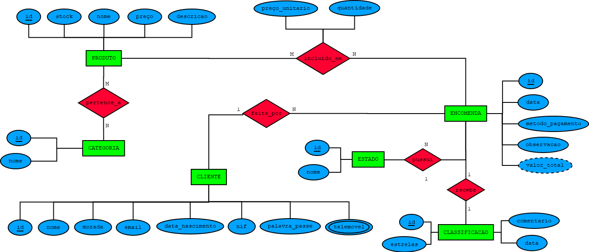

# C3 : Esquema conceptual

# Modelo Entidade-Associação (E/A)

## Entidade-Tipo: Produto

**Descrição:**  
A entidade "Produto" representa cada item disponível para venda na loja online. Esta entidade contém todas as informações essenciais sobre o produto, permitindo que os funcionários e administradores possam consultar, editar e controlar o catálogo da loja.

### Atributos:
- **ID:** Identificador único para cada produto.
- **Nome:** Nome do produto.
- **Preço:** Valor do produto.
- **Stock:** Quantidade de unidades disponíveis em stock.

## Entidade-Tipo: Cliente

**Descrição:**  
A entidade "Cliente" contém informações sobre os clientes da loja online. Cada cliente tem um registo único no sistema, que armazena dados pessoais essenciais para a realização de compras e a gestão de encomendas.

### Atributos:
- **ID:** Identificador único do cliente.
- **Nome:** Nome do cliente.
- **E-mail:** Endereço de e-mail do cliente.
- **Telemóvel:** Número de telefone do cliente.
- **Morada:** Endereço de entrega do cliente.
- **Data_Nascimento:** Data de nascimento do cliente.
- **NIF:** Número de Contribuinte do cliente, sendo este opcional.

## Entidade-Tipo: Encomenda

**Descrição:**  
A entidade "Encomenda" representa uma compra realizada por um cliente. Cada encomenda está associada a um cliente e contém informações sobre a data em que foi feita, o valor total da compra e os produtos incluídos.

### Atributos:
- **ID:** Identificador único da encomenda.
- **Data:** Data em que a encomenda foi realizada.
- **Valor_Total:** Valor total da encomenda, este atributo será derivado da soma de (preço_unitario x quantidade) de todos os produtos que foram encomendados.

## Entidade-Tipo: Item

**Descrição:**  
A entidade "Item" representa um produto específico dentro de uma encomenda. Cada encomenda pode conter vários produtos, e esta entidade associa os produtos às encomendas feitas pelos clientes.

### Atributos:
- **Quantidade:** Quantidade de unidades do produto na encomenda.
- **Preco_Unitário:** Preço do produto no momento da compra.

## Entidade-Tipo: Categoria

**Descrição:**  
A entidade "Categoria" organiza os produtos da loja em grupos de acordo com o seu tipo ou características comuns. Cada produto é associado a uma categoria, facilitando a busca e filtragem de produtos no catálogo.

### Atributos:
- **ID:** Identificador único da categoria.
- **Nome:** Nome da categoria (ex.: "Cuidados com a Pele", "Cabelos", etc.).

## Entidade-Tipo: Estado

**Descrição:**  
A entidade "Estado" representa a situação atual de uma encomenda, como por exemplo "Em preparação", "Enviada", "Entregue" ou "Cancelada". Esta entidade permite classificar e acompanhar o progresso das encomendas ao longo do tempo.

### Atributos:
- **ID:** Identificador único da categoria.
- **Nome:** Nome do estado (ex.: "Em Preparação", "Enviado", etc.).

## Associações

### Produto - Categoria

**Descrição:**  
Cada produto pertence a uma categoria. A associação entre "Produto" e "Categoria" é de muitos para muitos, pois muitos produtos podem pertencer à mesma categoria e cada produto pode ter uma ou mais categorias.

**Cardinalidade:**  
Cada produto está associado a categorias e uma categoria pode conter vários produtos.

### Encomenda - Cliente

**Descrição:**  
Cada encomenda é realizada por um cliente. A associação entre "Encomenda" e "Cliente" é de muitos para um, pois cada cliente pode fazer várias encomendas, mas cada encomenda está associada a apenas um cliente.

**Cardinalidade:**  
Um cliente pode ter várias encomendas, mas cada encomenda pertence a um único cliente.

### Encomenda - Produto

**Descrição:**  
Uma encomenda pode conter vários produtos. A associação entre "Encomenda" e "Produtos" é de muitos para muitos, pois uma encomenda pode ter vários produtos e o mesmo produto pode estar em mais que uma encomenda.

**Cardinalidade:**  
Um produto pode ser incluído em várias encomendas e uma encomenda pode conter vários produtos.

### Encomenda - Estado

**Descrição:**  
A associação possui indica que cada encomenda está associada a exatamente um estado que representa a sua situação atual no processo de compra. Esta ligação permite identificar o estado atual de cada encomenda num dado momento.

**Cardinalidade:**  
Uma Encomenda apenas pussui um estado e um estado pode estar em várias encomendas.

## Diagrama do Modelo Entidade-Associação
 

O Diagrama mostra a estrutura dos dados da loja online. Representa os clientes, as encomendas que fazem, os produtos disponíveis, as categorias desses produtos e os diferentes estados das encomendas. Ajuda a perceber como tudo se liga e como a informação está organizada no sistema.

## Regras de Negócio Adicionais (Restrições)

- **Quantidade de Produtos em Stock:**  
  A quantidade de produtos em stock nunca pode ser negativa. Se o stock não for suficiente para uma encomenda, o sistema deve impedir a finalização da compra.

- **Preço do Produto:**  
  O preço de qualquer produto deve ser sempre um valor positivo. Produtos com preço igual a zero ou negativo não podem ser vendidos.

- **Clientes Únicos:**  
  Não pode haver dois clientes com o mesmo e-mail ou número de telefone no sistema. O sistema vai verificar isso ao registar ou editar um cliente.

- **Status da Encomenda:**  
  Cada encomenda tem um status único, como "Em Processamento", "Enviado" ou "Cancelado". O status não pode ser alterado de forma inconsistente. Por exemplo, não se pode mudar uma encomenda "Enviada" para "Em Processamento".

- **Data da Encomenda:**  
  A data de uma encomenda deve ser sempre posterior à data de registo do cliente. Não é possível fazer uma encomenda antes de o cliente estar registado no sistema.

- **Quantidade Mínima e Máxima de Produtos:**  
  Cada produto tem um número mínimo e máximo de unidades que podem ser compradas numa única encomenda. O sistema vai garantir que a quantidade encomendada respeite esses limites.

- **Alteração de Preço Após Encomendas:**  
  O preço de um produto pode ser alterado, porém não afetará as encomendas anteriores à mudança.

- **Pagamentos:**  
  Uma encomenda só pode ser enviada depois de o pagamento ser confirmado, com excessão do método de pagamento de "contra-reembolso" (com uma taxa acrescida de 1,95€). Caso contrário, se o pagamento não for processado corretamente, a encomenda não pode ser marcada como "Enviada".

- **Atualização de Stock:**  
  O stock de produtos deve ser atualizado corretamente sempre que uma encomenda for realizada ou cancelada, garantindo que as quantidades disponíveis estão sempre corretas.

---
[< Previous](rei02.md) | [^ Main](/../../) | Next >
:--- | :---: | ---: 
